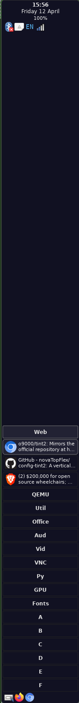

# config-tint2
A horizontal-layout, bottom-of-screen setup for the Tint2 taskbar recommended by novaTopFlex
# Specifications
This Tint2 setup is based on the opaque version of the dark horizontal taskbar from the default installation of Tint2. However, most of the unsaturated, and thus gray, colors have been replaced with similarly dark shades of blue. The positioning of this taskbar implementation has not been impacted; this bar should remain at the bottom of the display.
## Width and Height
The height of this taskbar should appear dynamically set to 2% of the device resolution height. The width of this taskber should appear dynamically set to the full device resolution width, thus the bottom taskbar appearance.
## Screenshot

